# GPT-GlassOnion

GPT-GlassOnion is a governed geospatial ontology and multi-agent research framework for Palantir AIP and the Zyra ecosystem. It models authorized data as typed objects, links, actions, provenance records, and GeoJSON layers, then coordinates 24 specialist agent profiles plus a synthesis coordinator across deterministic waves of 3, 6, 7, and 9 executions.



## Capabilities

- Foundry-inspired object, property, link, and action ontology
- GeoJSON Point, LineString, and Polygon validation
- Deterministic 3 → 6 → 7 → 9 agent-wave orchestration
- 24 specialist profiles and one synthesis coordinator
- Citation, confidence, lineage, and SHA-256 audit records
- Zyra-compatible JSONL knowledge export
- Local or AIP-hosted model-provider contract
- Civilian-use policy controls

## Installation

GPT-GlassOnion is cloud-first. Deploy the `osdk_app` directory to an authorized Node.js 20+ cloud or Foundry Compute Module environment.

1. Create a code repository or Compute Module in the target Foundry project.
2. Add the contents of `osdk_app` to that cloud repository.
3. Run `npm test` and require all tests to pass before deployment.
4. Configure `PORT` if the platform does not supply it automatically.
5. Start the service with `npm start`.
6. Confirm `GET /health` returns `{"status":"ok","auditValid":true}`.
7. Connect only project-approved Ontology objects, Actions, and data sources.

No local model download, packaged GlassOnion model, credentials, or customer data are included.

## Demo

Run `npm run demo` in the cloud build environment to execute all four bounded waves. Import the response from `GET /map.geojson` into a Foundry Map layer to visualize authorized geospatial objects.

## Palantir configuration

1. Create or select Foundry object types for KnowledgeSource, Place, Observation, Agent, and Finding.
2. Map their properties using `ontology.schema.json`.
3. Configure Actions for governed ingestion and finding approval.
4. Register the service as a Compute Module or adapt the provider contract to AIP Logic.
5. Grant the service identity only the object and action permissions required for the selected project.
6. Import the resulting GeoJSON into a Map layer or bind geometry properties directly to Ontology objects.

This contribution contains no credentials, customer data, proprietary Palantir source code, or claims of Palantir affiliation.

## Usage

```bash
npm test
npm run demo
npm start
```

Default API routes:

- `GET /health`
- `GET /ontology`
- `GET /map.geojson`
- `GET /audit`
- `POST /swarm/run`

Example objective:

```json
{"objective":"Map public climate resilience resources in Virginia"}
```

## Agent model

The wave sizes total 25 executions. Slots 1–24 are bounded specialist profiles. Execution 25 is the synthesis coordinator in the final nine-member wave. “Agent” means a registered task profile, not a claim of consciousness or independent authority.

## Data governance

Use public or properly authorized data. Preserve source URL, rights basis, retrieval time, content hash, model version, citations, confidence, and lineage. Consequential decisions require human approval. The default policy rejects weapon targeting, covert surveillance, facial tracking, credential bypass, and autonomous physical-force workflows.

## Requirements

- Node.js 20 or later
- A Palantir Foundry/AIP tenant for platform integration
- Appropriate Ontology, Action, and Compute Module permissions
- User-provided model provider for production inference

## Sources

- [Palantir Ontology overview](https://www.palantir.com/docs/foundry/ontology/overview/)
- [Ontology core concepts](https://www.palantir.com/docs/foundry/ontology/core-concepts/)
- [Ontology objects on maps](https://www.palantir.com/docs/foundry/map/integrate-objects/)
- [Action logs](https://www.palantir.com/docs/foundry/action-types/action-log/)
- [Foundry security overview](https://www.palantir.com/docs/foundry/security/overview/)

## License

Apache License 2.0. See [LICENSE](LICENSE).
